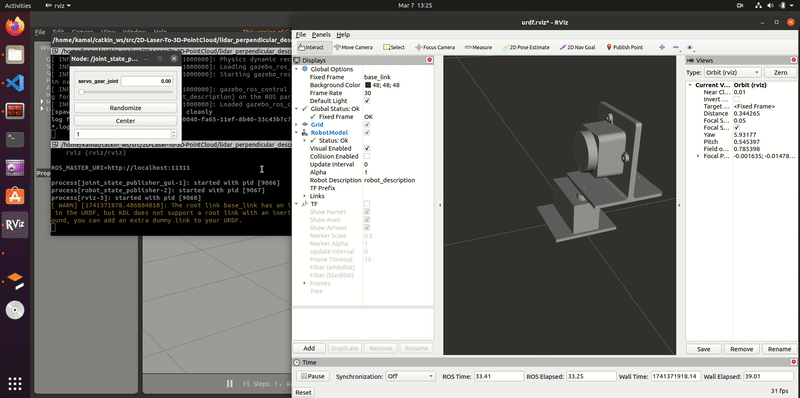
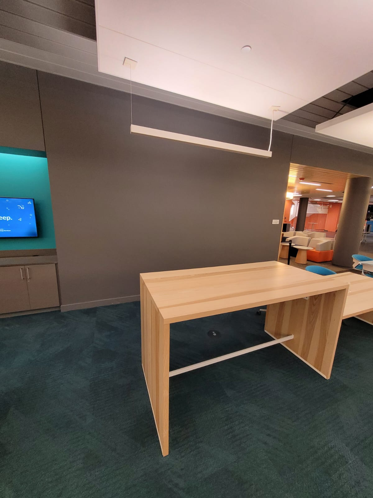

# 2D-Laser-To-3D-PointCloud
This pack is made to convert the 2D laser points to 3D point cloud data by placing the 2D lidar in certain position and make the sweep movement using servo to convert the entire environment.


Most mobile robots utilizing the Robot Operating System (ROS) rely on LiDAR-based Simultaneous Localization and Mapping (SLAM), with indoor robots often employing 2D 
SLAM. While some robots are designed to operate both indoors and outdoors, navigating in dynamically changing environments presents challenges. For instance, 2D LiDAR can only detect obstacles in the plane of the sensor, often missing vertical obstacles such as chairs or hanging objects, which can lead to collisions despite careful placement of the LiDAR. One potential solution is to use 3D LiDAR, which provides a full 360° detection range. However, 3D LiDAR sensors are significantly more expensive.

In this project, we propose a novel approach to generate 3D point cloud data using a 2D LiDAR by adapting the sensor's position and movement. Specifically, we suggest two methods:

 1. Perpendicular Rotation Method: The LiDAR is mounted perpendicular to the environment, with the base of the LiDAR rotating back and forth by 180° to capture 2D 
data at different vertical angles, creating a pseudo-3D point cloud.

 2. Parallel Rotation Method: The LiDAR is placed parallel to the environment and moves 
vertically (up and down) while the base rotates 180° horizontally, again collecting 2D 
LiDAR data at various heights to simulate a 3D scan.

While both methods can generate a 3D representation of the environment, the rotation speed and update frequency of the LiDAR are important factors in capturing dynamic obstacles.

In the first method, the LiDAR takes longer to complete a full rotation, which may result in delayed updates when dynamic objects enter the detection range. In contrast, the second method, which involves less than 180° rotation, can potentially yield faster updates by reducing the time 
for each cycle.

In this project, we have implemented both methods and compared the resulting 3D point clouds in terms of accuracy, scan quality, and update frequency. The primary objective is to optimize the generation of 3D point clouds using a cost-effective 2D LiDAR, enabling mobile robots to more effectively navigate complex, dynamic environments.

Refer to report for more details: [Project Report](EECE%205554%20Robot%20Sensing%20and%20Navigation%20Project%20Report.pdf)

Project Presentation: [Project Presentation](RSN%20Group%201%20Final%20Project%20Presentation.pdf)

Design Simulation Perpendicular Setup: (https://youtu.be/tiI5wXRkyYs)

Design Simuation Parallel Setup: (https://youtu.be/xUL9Ji8f-34)

Simualtion Video: 

Data Collection Videos: [Data Collection](https://drive.google.com/file/d/1g8c5KrMecnTnCA1v_zL3hP36YdpIE01s/view?usp=drive_link)

## Results of 2D laser to 3D point cloud 

### perpendicular setup


### perpendicular setup environment1


### perpendicular Point Cloud1


### perpendicular setup environment2


### perpendicular Point Cloud2


<!-- 

 -->

## laser_2d_to_3d
This has the main algorithm to convert 2D laser points to 3D pointcloud data, arduino code to run the servo, config files, source file to command servo, and launch files as well.

### laser_2d_to_3d/algorithm
This folder contains the algorithm to convert 2D laser points to 3D pointcloud data.

### laser_2d_to_3d/arduino code
This folder contains the arduino code to run the servo.

### laser_2d_to_3d/config
This folder contains the config file for rviz to visualize the 2D map which was used for lidar testing using hector slam.

### laser_2d_to_3d/2d_data_raw
This folder contains the raw 2D laser data recoreded as ros bag files.

### laser_2d_to_3d/3d_data_processed
This folder contains the processed 3D pointcloud data as ros bag files.

### laser_2d_to_3d/images
This folder contains the images of the experiment.

### laser_2d_to_3d/launch
This folder contains the launch files to launch the pre existing map in the maps folder.

### laser_2d_to_3d/maps
This folder contains the maps generated using hector slam.

### laser_2d_to_3d/setup
This folder contains the setup files for the project using arduino.

### laser_2d_to_3d/src
This folder contains the source file to command the servo.

## ldlidar_stl_ros-3.0.3
This is the ROS package for the LiDAR sensor. This is the default package given by the manufacturer.

Refer to the readme file in the folder for more information on how to use the lidar.
[Lidar Readme](ldlidar_stl_ros-3.0.3/README.md)

## lidar_perpendicular_description
This is the description file for the entire experiment to load in the simualtion.

### lidar_perpendicular_description/urdf
This folder contains the urdf file for the simulaiton, gazebo and xacro files.

### lidar_perpendicular_description/meshes
This folder contains the mesh files for the simulaiton.

### lidar_perpendicular_description/launch
This folder contains the launch files for the simulaiton to launch gazebo, rviz.

## To Run Algorithm or recreate the environment setup

- power up the arduino and push the code given code to ardunio and use modify the pins of boards according to your convenience.

- Then run the ros serail node to establish commuication. check this link for more details on [ROS Serial Arduino](https://wiki.ros.org/rosserial_arduino/Tutorials)

- Next run the code from src to publish commands to servo movement.

```bash
rosrun laser_2d_to_3d servo_sweep.py
```

- Launch Lidar Driver Refer to [Lidar Readme](ldlidar_stl_ros-3.0.3/README.md)

- Record the Laser data with servo angles using ROS Bag. Refer to [ROS Bag](https://wiki.ros.org/Bags) for more information on using it.

- Run the algorithm to convert the 2D Laser points to 3D Point Cloud Data


Sure! Here's the README content in markdown format for easy copy-paste:


## Requirements

- Python 3.x
- ROS (Robot Operating System) installed
- Required libraries: `open3d`, `open3d_ros_helper`, `rosbag`, `argparse`, `numpy`, `rospy`
  
You can install the necessary dependencies via pip:

```bash
pip install open3d numpy rospy
```

Make sure ROS is correctly set up and sourced before running the script.

## Usage

The script can be run from the command line with the following arguments:

```bash
python scan2cloud.py.py <bag_file> [OPTIONS]
```

### Arguments

- `bag_file` (required): Path to the ROS bag file containing the LIDAR data.
  
### Optional Arguments:

- `--mount <MOUNT_STYLE>`  
  **Default**: `perpendicular`  
  Mount style for the LIDAR. Options:
  - `perpendicular`: Mount the LIDAR sensor perpendicular to the surface.
  - `parallel`: Mount the LIDAR sensor parallel to the surface.

- `--test`  
  If specified, the script will ignore the bag file argument and generate random spherical data for testing purposes.

- `--lidar-right`, `-r`  
  If specified, the script uses the right side of the LIDAR (angle range 180° to 355°) instead of the left side.  
  **Note**: This option is mutually exclusive with `--lidar-left`.

- `--save-ply`  
  If specified, the script will save the point cloud to a `.ply` file (Open3D format).

- `--output-bag`, `-o`  
  If specified, the script will output the point cloud as a ROS PointCloud2 message and save it as a new bag file.

## Example Commands

1. **Convert a bag file to a point cloud and visualize it**:
   ```bash
   python scan2cloud.py.py data.bag
   ```

2. **Save the point cloud to a `.ply` file**:
   ```bash
   python scan2cloud.py.py data.bag --save-ply
   ```

3. **Convert the point cloud to a ROS bag file**:
   ```bash
   python scan2cloud.py.py data.bag --output-bag
   ```

4. **Test with generated spherical data (without bag file)**:
   ```bash
   python scan2cloud.py.py --test
   ```

5. **Use right side of LIDAR and convert to point cloud**:
   ```bash
   python scan2cloud.py.py data.bag --lidar-right
   ```

## Notes on Mount Styles

- `MOUNT_PERPENDICULAR`: This setting assumes the LIDAR is mounted perpendicularly to the horizontal surface, usually looking down or up.
- `MOUNT_PARALLEL`: This setting assumes the LIDAR is mounted parallel to the surface, usually facing horizontally.

## File Output

- If `--save-ply` is specified, a `.ply` file will be saved in the current directory, with the name based on the original `.bag` file (e.g., `data.ply`).
- If `--output-bag` is specified, the script will generate a new ROS bag file containing the point cloud data. The output file will be named based on the input bag file (e.g., `cloud_data.bag`).
